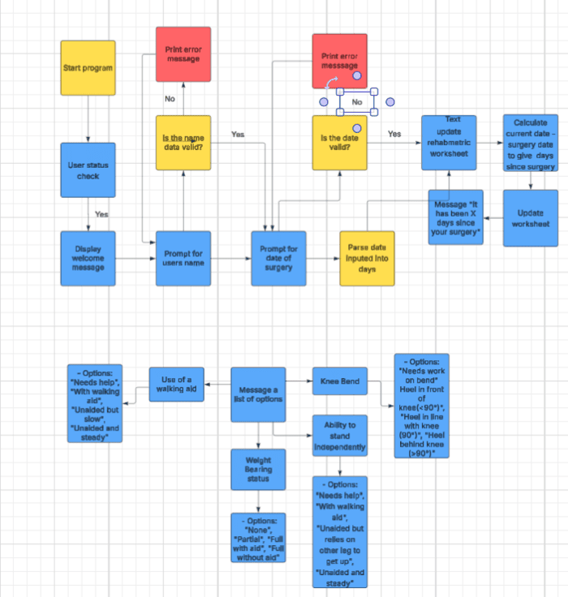
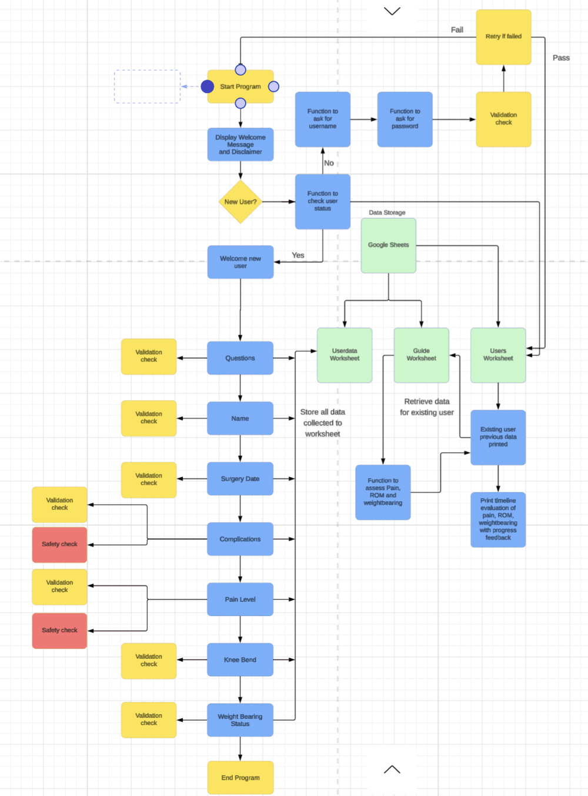
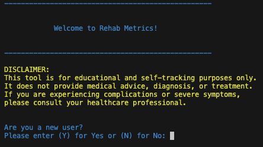
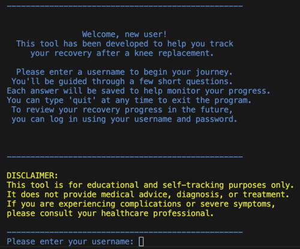
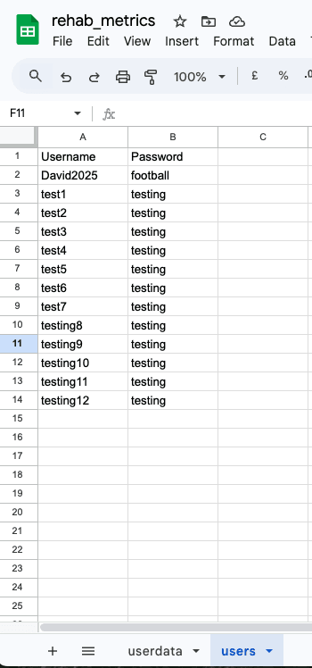
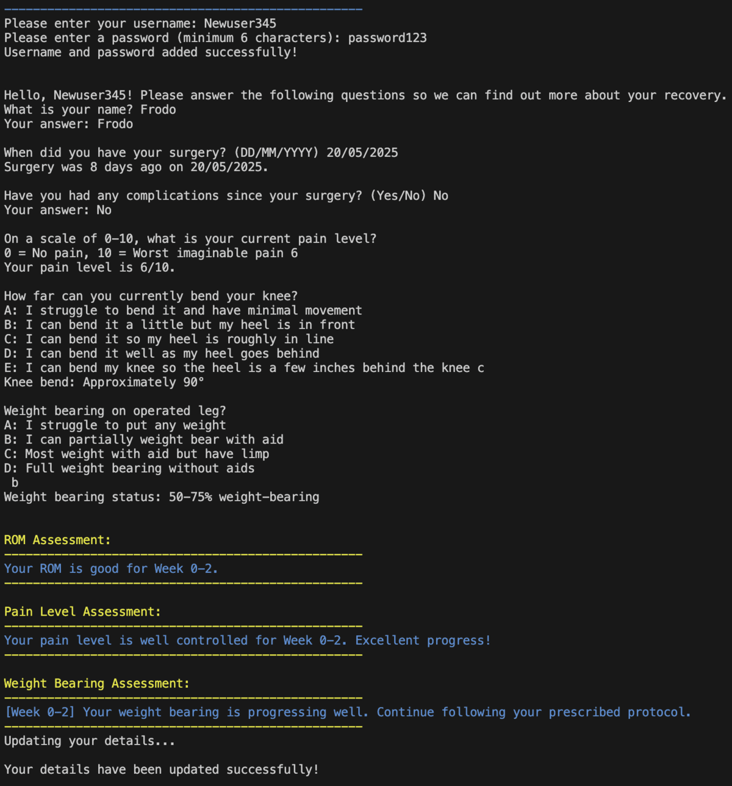
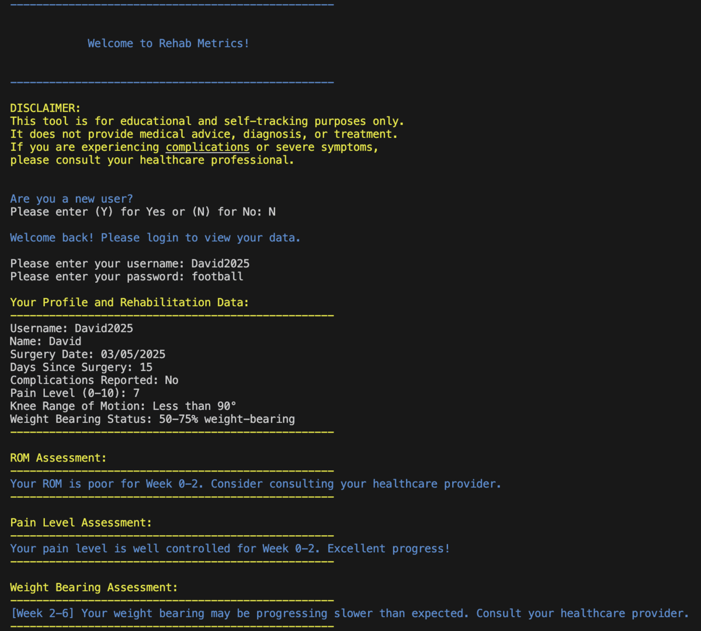

# Rebab Metrics

Rehab Metrics is a post-surgery rehabilitation tracking tool that helps patients monitor their recovery progress, with a particular focus on knee rehabilitation. Built in Python and deployed via Code Institute's Heroku terminal, the app features secure user registration and login with validation for usernames and passwords. Users enter their details, and the app calculates their stage in the rehabilitation journey, providing feedback on pain levels, knee range of motion, and weight bearing status. All data is securely stored using Google Sheets integration. Rehab Metrics is intended as a supportive self-monitoring tool and includes prompts to consult a healthcare professional when needed, as it does not provide medical advice.

## Project Plan

### Project Goals
I developed Rehab Metrics inspired by a close relative who recently underwent a knee replacement. They had many questions about their recovery, particularly around the expected timeline and what level of movement and activity they should be achieving in the first few months. This app aims to provide clear, stage appropriate guidance to help users monitor their progress and feel more confident during their recovery. From this experience, I realised I could create a project that collects user data and provides advice on key areas of recovery, helping patients understand their progress and what to expect during rehabilitation.

## User Stories

### Target Audience

The target audience for Rehab Metrics is people who have recently undergone knee surgery and want to track their recovery progress.

### First Time Visitor Goals

As a first-time user, I want to:

* Easily navigate the application and understand its purpose
* Enter my personal and surgery details
* Have a record of my details that provides feedback on my progress

### Returning Visitor Goals

As a returning user, I want to:

* Log in securely with my username
* Enter my password to protect my information
* Review my previously entered details and progress

### Site Owner Goals
As the creator of Rehab Metrics, my goal is to develop an intuitive and accessible rehabilitation tracking tool for individuals recovering from knee surgery. I aim to:

* Create a user-friendly interface that avoids medical jargon.
* Ask clear, structured questions that users can easily understand and respond to.
* Convert the user's input into approximate, meaningful feedback about their stage of recovery.
* Store data securely using Google Sheets.
* Allow returning users to retrieve their previous entries by logging in with a username and password.
* The focus is to provide reassurance and progress tracking during a crucial recovery period.

### Structure of the program
At the start of the project, I created a draft flowchart to visualise the program's intended structure. I had a clear end goal in mind, outlining the key questions and the type of data I aimed to collect and store using Google Sheets.

The early flow focused on capturing user information and guiding them through recover related questions:

     
As the project progressed, I refined the flow to include input validation and safety checks to improve the user experience. The final algorithm shows the outcome for new and existing users:

## Features

### Welcome Message and User Status Check

The application launches via python3 run.py. A welcome message with a disclaimer will appear and will ask the user if they are a new user. The main function will be called first and will use the check_user_status function before calling the welcome_user function.

The check_user_status function will ask if the user is a new or an existing user.  

The welcome_user function works together with the functions validate_user, check_existing_username, user_password and update_user_worksheet to guide the new user through the sign-up process. After the user inputs their data it will then be saved new to a Google Sheet (users worksheet).

From the image above you can see there is a welcome message displayed with instructions and a disclaimer. If the user enters 'yes' for a new user then the program will then prompt the user to enter their username and validate this. Validation also includes checking the google sheet for usernames that already exist. After entering the username a prompt will appear to input a password. Both the username and password will be saved in Google sheets if the credentials are valid.

********************************

### New User Journey

The questions() function guides the user through a structured assessment consisting of six simple questions. These questions are designed to collect relevant post-operative information following a knee replacement surgery. The collected data contributes to a personalised rehabilitation log of their data.

The six questions include:
1. First Name
The user is prompted to enter their first name and make the tool more personalised.
2. Surgery Date
The user inputs the date of their knee replacement surgery. This information is used to calculate how many days have passed since the procedure.
3. Complications
The User will answer 'yes' or 'no' to indicate if they had any complications. If "yes" is selected, the assessment ends immediately with advice to consult a healthcare professional, ensuring a safety-first approach as using the tool.
4. Pain Level
A numeric pain rating is collected on a scale of 0-10 to help gauge their discomfort level. While this value is subjective and can vary significantly between users, it remains a critical data point. A high pain score may indicate underlying issues that could require attention from a healthcare professional.
5. Knee Bend Assessment
The user selects from one of the four options that best describes their ability to bend their knee. This selection is internally converted to an estimated knee flexion value and displayed back to the user.
6. Weight Bearing Status
The user selects one of four options to describe their current weight bearing status. This input is also converted into a descriptive status and shown back to the user.

The answers provided by the user are stored for later display and progress tracking.

### Returning User Journey

 

Returning users begin by entering their previously registered username and password. The tool then verifies the credentials to ensure the user is authenticated before proceeding. Upon successful login, users are guided through the assessment questions to update their rehabilitation progress.

This uses the functions handle_returning_user(), which works by prompting the user to input their username and password. It will then check if the username exists. The tool will then call verify_password() to authenticate the user. If authentication is successful, it loads the user's existing data from 'userdata' worksheet in Google Sheets. If login fails (due to incorrect credentials or non-existent username), the user is informed and given the option to retry or return to the main menu. Please see [Validation](#validation) for further details.

The verify_password function checks whether the password entered by the user matches the stored password for that username. It retrieves the password from the 'users' worksheet in Google Sheets and performs a comparison of the entered password and the stored one. It will return True if the credentials match, allowing the user to proceed; otherwise, returns False, triggering an error message and prompting for re-entry. Please see [Validation](#validation)

Upon completing the assessment questions, the app evaluates recovery progress using the following functions (located in guide.py):
* get_rom_timeline_assessment() – Evaluates range of motion progress (e.g., knee bend).

* get_pain_timeline_assessment() – Evaluates reported pain levels and highlights any concerning scores.

* get_weight_bearing_timeline_assessment() – Evaluates weight-bearing progress and mobility status.

### Data Storage

All user data is stored securely in Google Sheets using the gspread library:

* "users" worksheet – Stores login credentials (usernames and passwords).

* "userdata" worksheet – Stores each user's recovery progress that is from the answers to assessment questions.

* update_rehab_metrics_worksheet() is responsible for storing all validated assessment data.

### Data Processing and Retrival

* The app determines how many days have elapsed since the user’s recorded surgery date using the calculate_days_since_surgery() function. This value is essential for placing the user's rehabilitation progress in the correct timeframe and helps tailor the feedback they receive accordingly.
* The app retrieves the most recent user data from Google Sheets, allowing for comparison with current inputs.
* get_user_data() – This function fetches the user's previous entries from the "userdata" worksheet based on their username.

### Validation

All inputs are validated. Invalid entries trigger error messages in red coloured text and offer retry prompts.

The login process verifies both username and password before proceeding.

validate_user(input_str)
* Ensures that the username is between 2 and 10 characters long.
* Disallows special characters using a predefined NOT_VALID list.
* If the username is valid and unique (or exists for returning users), it is accepted.

user_password()
* Prompts the user to enter a password.
* Uses validate_password() for validation.
* Continues prompting until a valid password is entered or the user types 'quit'.

validate_password(password)
* Ensures the password is at least 6 characters long.
* Disallows spaces to prevent formatting issues.
* Returns True if the password is valid; otherwise, returns False.

Each assessment question has tailored validation to ensure data is appropriate.
* validate_date() - Checks if the surgery date is in the correct YYYY-MM-DD format and ensures the date is not in the future.
* validate_complications() - Accepts only "Yes", "No", or variations thereof (e.g., "Y", "N").
* validate_pain_scale() - Confirms that the pain input is a number between 0 and 10.
* validate_rom() - Accepts only choices A–E. 
* validate_weight_bearing() - Accepts only choices A–D.

### Safety Feature
The program includes built-in safety mechanisms to help protect users by identifying red flags that may require clinical attention:
* If a user reports a pain level of 10 (the maximum on the 0–10 scale), the program immediately terminates the session and advises the user to consult a healthcare professional. This serves as a safeguard against potentially serious complications.
* If the user's input indicates severely limited weight-bearing ability (e.g., unable to place any weight on the operated leg), the program also exits and directs the user to consult a healthcare professional for further assessment.
* There are warning messages for concerning symptoms.
* There are screening for any complications during the questions. 

Images for safety features************************************

### Program Controls & Error Handling
* Users can exit the program at any point by typing 'quit'. This allows for a user-friendly and accommodating interruptions or changes of mind without causing errors or data loss.
* After each input or action, the user receives immediate, clear feedback. This includes confirmation of successful entries, detailed error messages for invalid inputs, and instructions on how to proceed or correct mistakes.
* All inputs are monitored for validity. Invalid entries prompt user-friendly error messages and re-prompt the user to try again.

### Timeline Based Assessment
The program evaluates recovery progress across four key timeframes following knee replacement surgery:

* 0-2 weeks: Initial recovery phase
* 2-6 weeks: Early recovery phase
* 6-12 weeks: Mid-term recovery
* 12+ weeks: Long-term recovery

#### Week 0-2 (Initial Recovery)
* Range of Motion (ROM):
  - Poor: Less than 90° knee flexion
  - Good: Approximately 90° knee flexion
  - Excellent: Greater than 100° knee flexion
* Pain Levels:
  - High (8-10): Normal but requires close monitoring
  - Typical (6-7): Expected for this stage
  - Well Controlled (0-5): Excellent progress
* Weight Bearing:
  - Appropriate: 0-25% weight-bearing
  - Progressing Well: 50-75% weight-bearing
  - Excellent: 75%+ weight-bearing

#### Week 2-6 (Early Recovery)
* Range of Motion (ROM):
  - Poor: Less than 90° knee flexion
  - Functional: Approximately 90° knee flexion
  - Excellent: Greater than 100° knee flexion
* Pain Levels:
  - Concerning: 6 or higher
  - Typical: 3-4
  - Well Managed: 2 or lower
* Weight Bearing:
  - Slow Progress: 50% or less weight-bearing
  - Appropriate: 75%+ weight-bearing
  - Excellent: Full weight-bearing

#### Week 6-12 (Mid-term Recovery)
* Range of Motion (ROM):
  - Poor: Less than 90° knee flexion
  - Functional: Approximately 90° knee flexion
  - Excellent: Greater than 100° knee flexion
* Pain Levels:
  - Concerning: 6 or higher
  - Typical: 4-5
  - Excellent: 3 or lower
* Weight Bearing:
  - Below Expected: 50% or less weight-bearing
  - Progressing: 75%+ weight-bearing
  - Appropriate: Full weight-bearing

#### Week 12+ (Long-term Recovery)
* Range of Motion (ROM):
  - Poor: Less than 100° knee flexion
  - Good: Approximately 100° knee flexion
  - Optimal: 120° knee flexion
* Pain Levels:
  - Elevated: 5 or higher
  - Typical: 3-4
  - Excellent: 2 or lower
* Weight Bearing:
  - Below Expected: Less than 100% weight-bearing
  - Excellent: Full weight-bearing

The program automatically calculates the user's recovery stage based on their surgery date and provides stage-appropriate feedback for each metric. This timeline-based assessment helps users understand their progress in context and identify areas that may require attention or healthcare professional consultation.

## Future Features
* Provide assessment advice on all metrics 
* Questions on walking and climbing stairs to idetify any functional problems
* Provide advice and compare their walking and ability to climb stairs with expected data within a 12 week timelime
* Provide questions on swelling, fever and sudden worsening of symptoms to clear any red flags and to advise ther user to seek advice
* Returning users can input new data and then compare any changes from their previous data. This would be good for user experience.
* Provide more tailored advice for stage of recovery by asking more detailed questions 

## Technologies Used

## Python Version and Packages

## Bugs and Fixes
Please see fixes in [TESTING.md](TESTING.md) for more details of bug fixes from manual testing.

The ROM assessment function had a typo in the ROM_CONVERSION dictionary for option E missing a degrees symbol. This caused the ROM assessment not to appear when option E selected for new users.

## Testing

### Manual Testing

See [TESTING.md](TESTING.md) for more details of manual testing.

### Validation Testing

I used CI Python Linter and followed PEP8.

From this i removed blanked lines, white spaces and adjusted the code to make lines less than 79 characters and 72 characters for docstrings. Imports were grouped  in the order of standard library imports, related third party important and local application imports respectively. 

https://peps.python.org/pep-0008/

https://pep8ci.herokuapp.com/#

## Deployment

## Forking and Cloning

## Credits

## Acknowledgements

