# Rebab Metrics

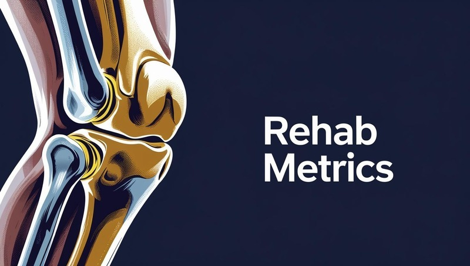

Rehab Metrics is a post-surgery tracking tool that helps users monitor their recovery progress, with a particular focus on knee recovery. Built in Python and deployed via Code Institute's Heroku terminal, the app features secure user registration and login with validation for usernames and passwords. Users enter their details, and the app calculates their stage in the recovery journey, providing feedback on pain levels, knee range of motion, and weight bearing status. All data is securely stored using Google Sheets integration. Rehab Metrics is intended as a supportive self-monitoring tool and includes prompts to consult a healthcare professional when needed, as it does not provide medical advice.

Link to live page: [Rehab-Metrics](https://rehab-metrics-5347677ed9d1.herokuapp.com/)

## Contents

* [Project Goals](#project-goals)
* [User Stories](#user-stories)

### Features
* [Welcome Message and User Check](#user-stories)
* [Google Worksheet](#google-worksheet-users)
* [New User Journey](#new-user-journey)
* [Assessment Questions](#assessment-questions)
* [Returning User Journey](#returning-user-journey)
* [Profile and Assessment](#profile-and-assessment)
* [Data Storage](#data-storage)
* [Data Processing and Retrival](#data-processing-and-retrival)
* [Validation](#validation)
* [Update Menu Options](#update-menu-options)
* [Exit Option](#exit-option)
* [Safety Features](#safety-feature)
* [Timeline Based Assessment](#timeline-based-assessment)

### Future Features
* [Future Features](#future-features)

### Technologies Used
* [Technologies Used](#technologies-used)

### Python Version, Packages and Libaries Used
* [Python Version, Packages and Libaries Used](#python-version,-packages-and-libaries-used)

## Bugs and Fixes
* [Bugs and Fixes](#bugs-and-fixes)

### Testing
* [Manual Test](#manual-testing)
* [Validation Testing](#validation-testing)

### Deployment and Local Deployment
* [Deployment and Local Deployment](#deployment-and-local-deployment)
ß
## Forking and Cloning
* [Forking and Cloning](#forking-and-cloning)

### Credits and Acknowledgments
* [Credits and Acknowledgments](#credits-and-acknowledgments)

## Project Plan

### Project Goals
I developed Rehab Metrics inspired by a close relative who recently underwent a knee replacement surgery. They had many questions about their recovery, particularly around the expected timeline and what level of movement and activity they should be achieving in the first few months. This app aims to provide clear, stage appropriate guidance to help users monitor their progress and feel more confident during their recovery. From this experience, I realised I could create a project that collects user data and provides advice on key areas of recovery, helping users understand their progress and what to expect during recovery.

## User Stories

### Target Audience

The target audience for Rehab Metrics is people who have recently undergone knee surgery and want to track their recovery progress.

### First Time Visitor Goals

As a first-time user, I want to:

* Easily navigate the application and understand its purpose.
* Enter my personal details related to recovery.
* Have a record of my details that provides feedback on my progress.

### Returning Visitor Goals

As a returning user, I want to:

* Log in securely with my username.
* Enter my password to protect my information.
* Review my previously entered details and progress.

### Site Owner Goals
As the creator of Rehab Metrics, my goal is to develop an intuitive and accessible post operation tracking tool for individuals recovering from knee surgery. I aim to:

* Create a user-friendly interface that avoids medical jargon.
* Ask clear, structured questions that users can easily understand and respond to.
* Convert the user's input into meaningful feedback to give guidance on their stage of recovery.
* Store data securely using Google Sheets.
* Allow returning users to retrieve their previous entries by logging in with a username and password.
* The focus is to provide reassurance and progress tracking during a crucial recovery period.

[Back to Contents](#contents)

### Structure of the program
At the start of the project, I created a draft flowchart to visualise the program's intended structure. I had a clear end goal in mind, outlining the key questions and the type of data I aimed to collect and store using Google Sheets.

The early flow focused on capturing user information and guiding them through recovery related questions:

     
As the project progressed, I refined the flow to include input validation and safety checks to improve the user experience. The final algorithm shows the outcome for new and existing users:

[Back to Contents](#contents)

## Features

### Welcome Message and User Status Check

The application launches via python3 run.py. A welcome message with a disclaimer will appear and will ask the user if they are a new user. The main function will be called first and will use the check_user_status function before calling the welcome_user function.

The check_user_status function will ask if the user is a new or an existing user.  

The welcome_user function works together with the functions validate_user, check_existing_username, user_password and update_user_worksheet to guide the new user through the sign-up process. After the user inputs their data it will then be saved new to a Google Sheet (users worksheet).

From the image above you can see there is a welcome message displayed with instructions and a disclaimer. If the user enters 'yes' for a new user then the program will then prompt the user to enter their username and validate this. Validation also includes checking the google sheet for usernames that already exist. After entering the username a prompt will appear to input a password. Both the username and password will be saved in Google sheets if the credentials are valid.

#### Google Worksheet users

This worksheet stores the username and passwords:

#### Google Worksheet userdata

This worksheet stores the metric data:

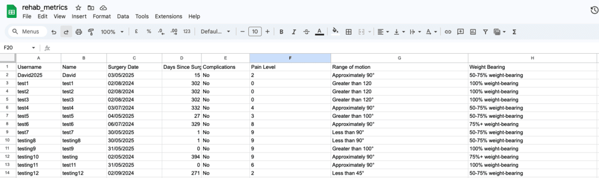

### New User Journey

The questions() function guides the user through a structured assessment consisting of six simple questions. These questions are designed to collect relevant post-operative information following a knee replacement surgery. The collected data contributes to a personalised log of their data.

The six questions include:
1. First Name
The user is prompted to enter their first name to make the tool more personalised.
2. Surgery Date
The user inputs the date of their knee replacement surgery. This information is used to calculate how many days have passed since the procedure.
3. Complications
The User will answer 'yes' or 'no' to indicate if they had any complications. If "yes" is selected, the assessment ends immediately with advice to consult a healthcare professional, ensuring a safety-first approach as using the tool.
4. Pain Level
A numeric pain rating is collected on a scale of 0-10 to help gauge their discomfort level. While this value is subjective and can vary significantly between users, it remains a critical data point. A high pain score may indicate underlying issues that could require attention from a healthcare professional.
5. Knee Bend Assessment
The user selects from one of the four options that best describes their ability to bend their knee. This selection is internally converted to an estimated knee flexion value and displayed back to the user.
6. Weight Bearing Status
The user selects one of four options to describe their current weight bearing status. This input is also converted into a weight bearing status and shown back to the user.

#### Assessment Questions

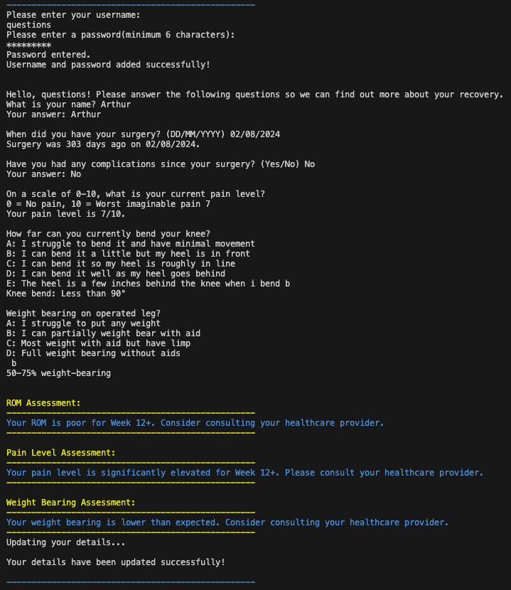

The answers provided by the user are stored. This is then displayed later for existing users for progress tracking.

#### Exit Message

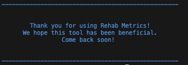

When users exit the program, they receive a friendly message encouraging future engagement.

### Returning User Journey

Returning users begin by entering their previously registered username and password. The tool then verifies the credentials to ensure the user is authenticated before proceeding. Upon successful login, users are guided through the assessment questions to update their recovery timeline.

This uses the functions handle_returning_user(), which works by prompting the user to input their username and password. It will then check if the username exists. The tool will then call verify_password() to authenticate the user. If authentication is successful, it loads the user's existing data from 'userdata' worksheet in Google Sheets. If login fails (due to incorrect credentials or non-existent username), the user is informed and given the option to retry or return to the main menu. Please see [Validation](#validation) for further details.

The verify_password function checks whether the password entered by the user matches the stored password for that username. It retrieves the password from the 'users' worksheet in Google Sheets and performs a comparison of the entered password and the stored one. It will return True if the credentials match, allowing the user to proceed; otherwise, returns False, triggering an error message and prompting for re-entry. Please see [Validation](#validation)

Upon completing the assessment questions, the app evaluates recovery progress using the following functions (located in guide.py):
* get_rom_timeline_assessment() – Evaluates range of motion progress (e.g., knee bend).

* get_pain_timeline_assessment() – Evaluates reported pain levels and highlights any concerning scores.

* get_weight_bearing_timeline_assessment() – Evaluates weight-bearing progress.

#### Profile and Assessments

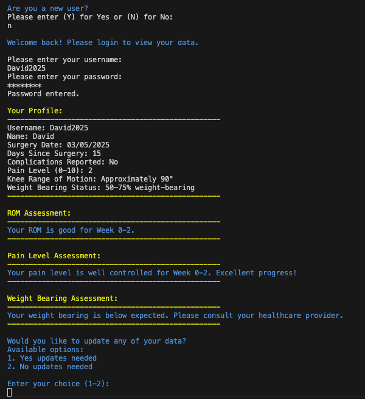

Returning users can view their previously entered data alongside updated assessments, helping them monitor recovery progress over time.

### Data Storage

All user data is stored securely in Google Sheets using the gspread library:

* "users" worksheet – Stores login credentials (usernames and passwords).

* "userdata" worksheet – Stores each user's recovery progress that is from the answers to assessment questions.

* update_rehab_metrics_worksheet() is responsible for storing all validated assessment data.

### Data Processing and Retrival

* The app determines how many days have elapsed since the user’s recorded surgery date using the calculate_days_since_surgery() function. This value is essential for placing the user's progress in the correct timeframe and helps tailor the feedback they receive accordingly.
* The app retrieves the most recent user data from Google Sheets, allowing for comparison with current inputs.
* get_user_data() – This function fetches the user's previous entries from the "userdata" worksheet based on their username.

### Validation

All inputs are validated. Invalid entries trigger error messages in red coloured text and offer retry prompts.

#### Exception handling

Exception handling is implemented using try and except blocks across the program. If an error occurs, the function catches it and returns False, allowing the program to continue running safely while giving the user another opportunity to enter valid input. For example, the assess_pain_progress function checks for missing data (like days since surgery or pain level) and provides specific messages. If an unexpected issue arises, it catches the exception and returns False.

I have used exception handling with the following functions:
* calculate_days_since_surgery
* validate_pain_scale
* assess_rom_progress
* assess_pain_progress
* assess_weight_bering_progress
* update_rehab_metrics
* update_user_worksheet
* check_existing_username
* get_user_row
* get_user_data
* verify_password
* process_new_user
* get_rom_timeline_assessment
* get_pain_timeline_assessment
* get_weight_bearing_timeline_assessment

#### User Login Validation
The login process verifies both username and password before proceeding.

validate_user(input_str)
* Ensures that the username is between 2 and 10 characters long.
* Disallows special characters using a predefined NOT_VALID list.
* Disallows white spaces.
* If the username is valid and unique, it is accepted.

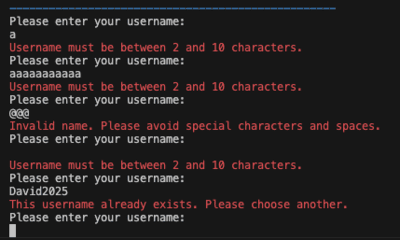

user_password()
* Prompts the user to enter a password.
* Uses validate_password() for validation.
* Continues prompting until a valid password is entered or the user types 'quit'.
* Uses maskpass to hide the password when entered.

validate_password(password)
* Ensures the password is at least 6 characters long.
* Disallows white spaces to prevent formatting issues.

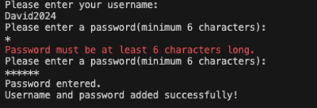

Each assessment question has tailored validation to ensure data is appropriate.
* validate_date() - Checks if the surgery date is in the correct YYYY-MM-DD format and ensures the date is not in the future or 0 days.
* validate_complications() - Accepts only "Yes", "No", or variations thereof (e.g., "Y", "N").
* validate_pain_scale() - Confirms that the pain input is a number between 0 and 10.
* validate_rom() - Accepts only choices A–E. 
* validate_weight_bearing() - Accepts only choices A–D.

#### Date Validation

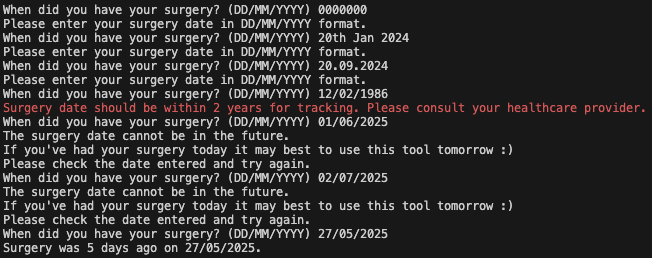

#### Complications Validation

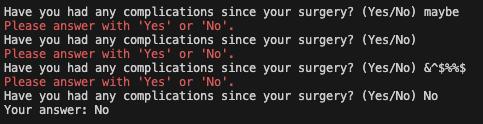

#### Pain Level Validation

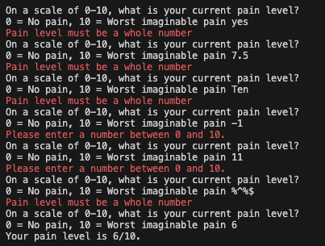

#### ROM Validation

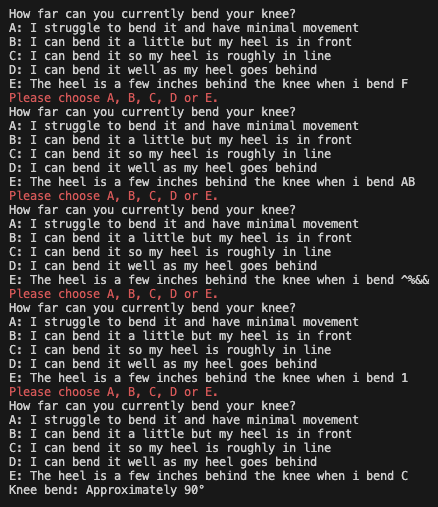

#### Weight-bearing Validation

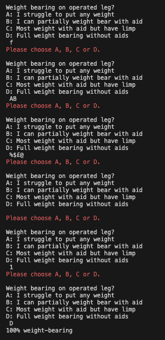

### Update Menu options
The function display_update_options() was added to give the users a choice to restart the assessment process or exit the program.
In future updates, it will allow users to update individual metrics they previously entered.

#### Update Data Option 

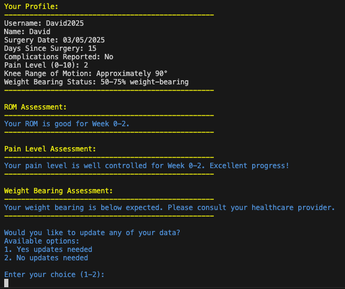

Selecting option 1 restarts the program, allowing the user to re-enter and add new data. In future updates, this will be expanded to let users select specific metrics they want to update.

#### Exit Option

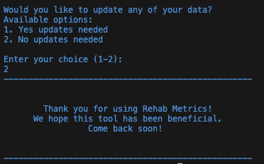

Selecting option 2 exits the program and displays a friendly farewell message.

### Safety Feature
The program includes built-in safety mechanisms to help protect users by identifying red flags that may require clinical attention:
* If a user reports a pain level of 10 (the maximum on the 0–10 scale), the program immediately terminates the session and advises the user to consult a healthcare professional. This serves as a safeguard against potentially serious complications.
* If the user's input indicates severely limited weight-bearing ability (e.g., unable to place any weight on the operated leg), the program also exits and directs the user to consult a healthcare professional for further assessment.
* If the user's input indicates complications (e.g., inputing 'yes'), the program exits and directs the user to consult a healthcare professional.
* The program includes warning messages for concerning symptoms. While it advises users to consult their healthcare professional, it still allows them to continue using the tool to support ongoing tracking and awareness.

#### Safety Feature for Complications

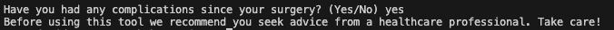

If the user reports "yes" to having post-operative complications, this suggests the presence of issues that may affect recovery. To avoid misleading the user with inaccurate feedback, the program exits immediately and recommends seeking medical advice before continuing with the tool.

#### Safety Feature for Pain

A reported pain level of 10 will trigger a warning message and exit the program, advising the user that their symptoms may require professional medical review before continuing with the program.

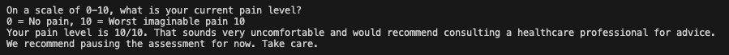

#### Safety Feature for Weight-bering

If a user reports being non-weight-bearing, the program will flag this and advise them to contact a healthcare professional. Inability to bear weight may indicate serious complications, making the use of this program inappropriate at any stage of recovery.

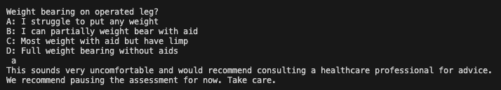

If the user is not weight-bearing beyond expected recovery timeframes, the program highlights this and suggests contacting a healthcare professional.

### Program Navigation and Feedback
* Users can exit the program at any point by typing 'quit'. This allows for a user-friendly and accommodating interruptions or changes of mind without causing errors or data loss.
* After each input or action, the user receives immediate, clear feedback. This includes confirmation of successful entries, detailed error messages for invalid inputs.
* Invalid entries prompt user-friendly error messages and re-prompt the user to try again. Please see [Validation](#validation) for further details.

#### User Exit

Below the user types 'quit' to exit the program.

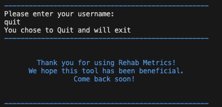

### Timeline Based Assessment
The program evaluates recovery progress across four key timeframes following knee replacement surgery:

* 0-2 weeks: Initial recovery phase
* 2-6 weeks: Early recovery phase
* 6-12 weeks: Mid-term recovery
* 12+ weeks: Long-term recovery

#### Timeline Assessments Example

This example shows each assessment with messages that notify the user about their progress in range of motion (ROM), pain, and weight bearing. The user also receives confirmation that their data has been saved successfully, followed by a farewell message indicating the program has ended.

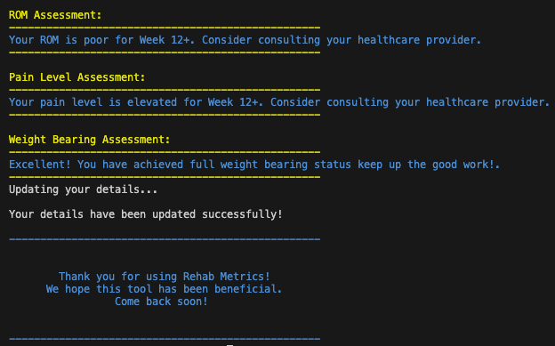

In guide.py, the program uses floor division (//) to convert the number of days into weeks. It then applies a series of conditional statements to assess the user’s input (e.g., range of motion, pain level, weight-bearing status) against clinically expected norms for each recovery stage. Each function generates customised feedback based on the user’s data, helping them understand whether their progress is poor, typical or above expectations.

The program automatically calculates the user's recovery stage based on their surgery date and provides stage-appropriate feedback for each metric. This timeline-based assessment helps users understand their progress and identify areas that may require attention or healthcare professional consultation.

[Back to Contents](#contents)

## Future Features
* Provide assessment advice on all metrics.
* Include questions on walking and stair climbing to identify functional difficulties.
* Compare users’ walking ability and stair climbing with expected recovery data across a 12-week timeline.
* Add complication screening questions to identify red flags, such as swelling, fever, or sudden worsening of symptoms, and advise users to seek urgent medical attention if necessary.
* Enable returning users to view their previous entries, update their information, and modify data in the worksheet.
* Offer more tailored advice by introducing detailed questions relevant to the user's specific stage of recovery.

[Back to Contents](#contents)

## Technologies Used
* Visual Studio Code with assistance of flake8 linter extension.
* [Github](https://github.com/) to host the repository.
* The [CI Python Linter](https://pep8ci.herokuapp.com/#) for validating the Python code.
* [Heroku](https://pep8ci.herokuapp.com/) for deploying the website.
* Flow charts from [Lucid Chart](https://lucid.app).
* Image Resizer [Image Resizer](https://imageresizer.com/) to resize images.
* Tiny PNG [TinyPNG](https://tinypng.com/) - To compress images and convert them to png.
* Slack - For updates and communication.
* [Canva](https://www.canva.com/) - For custom Rehab Metrics image.
* [Google ](https://www.canva.com/) - For custom Rehab Metrics image.

[Back to Contents](#contents)

## Python Version, Packages and Libaries Used
The project was developed using Python 3.13.2.

The following packages and libaries were used:
* datetime - Used to work with date and time, particulary to calculate recovery timelines based on number of days since surgery.
* gspread - Used to interact with Google Sheets API for reading and writing data to a spreadsheet. This was chosen for its efficient and simple for managing spreadhseet data.
* google.oauth2.service_account.Credentials - Provides secure authentication for access to Google Sheets API. This ensures only authorised users can access or update the stored data.
* colorama - Used to add colour to the terminal output and improve user experience.
* maskpass - Used to mask passwords when entered. This improves the security by hiding sensitive data.

[Back to Contents](#contents)

## Bugs and Fixes
Please see fixes in [TESTING.md](TESTING.md) for more details of bug fixes from manual testing.

* During development, one recurring issue was encountering KeyErrors. These typically occurred when I modified the text within string-based questions but did not update corresponding keys in other parts of the program that relied on those exact strings (e.g., when storing or retrieving user responses from dictionaries).

* Weight-bearing assessment bug - There was an issue with how weight-bearing status was formatted and assessed. This was due to the weight-bearing status being stored as a prefix. Therefore, it caused problems when trying to access the progress. The issue was resolved by using .replace() to strip the prefix and extract only the relevant weight-bearing value.

* There was an indexing error when accessing the ROM data from the user’s dataset. The function was referencing a column index that was one position too low, causing incorrect data to be retrieved for the ROM metric. Another issue that arose were mismatched headers in Google Sheets. The logic was updated to skip the first column when reading data from Google Sheets and making sure the correct header columns aligned accurately with the values.

* The ROM assessment function had a typo in the ROM_CONVERSION dictionary for option E missing a degrees symbol. This caused the ROM assessment not to appear when option E selected for new users. In addition, the assessment display required the validate_rom to store the ROM measurement and not the assessment message and adjusted format_user_data to display only the ROM measurement in the user profile.

* A deprecation warning occured when i copied the spreadsheet initialisation from run.py to guide.py. Removing this in guide.py resolved the warning.

* When the surgery date was entered as today's date, the program calculated days_since_surgery = 0, which evaluated as falsy in conditional checks. This incorrectly triggered error messages like:
Cannot perform ROM assessment: Days since surgery not available
To fix this i updated the logic in the validate_date() function to check if days_ago <= 0. Now, the program provides clear feedback and prompts the user to re-enter a valid surgery date instead of treating 0 as missing data.

* Heroku deployment error after adding maskpass import and updating requirements.txt. Resolved by removing macOS-only dependencies from requirements.txt, which were incompatible with Heroku's linux enviroment.

There are currently to my knowledge no known bugs in the program. All previously identified issues related to data indexing, string mismatches, and weight-bearing status formatting have been resolved.

[Back to Contents](#contents)

## Testing

### Manual Testing

See [TESTING.md](TESTING.md) for more details of manual testing.
Manual tests were carried out throughout the development process. Each feature was tested to ensure correct functionality, including error handling, user input validation, and support for multiple user accounts. This included:
- Username and Name Validation: Inputs were tested to confirm that whitespace and special characters were not allowed. The username was validated to accept only 2–10 characters.
- Password Validation: Password inputs were tested to ensure they were at least 6 characters long and contained no whitespace.
- New and Returning Users: Multiple scenarios were tested, including new user registration, returning user login, invalid entries, and quitting mid-process.

### Validation Testing

I used the [CI Python Linter](https://pep8ci.herokuapp.com/#) and followed the [PEP8 guidelines](https://peps.python.org/pep-0008/) to validate my code.

As a result of the linting process, I made the following adjustments:

1. Removed unnecessary blank lines and trailing white spaces.
2. Ensured that all lines are under 79 characters, and limited docstring lines to 72 characters as recommended.
3. Grouped imports in the correct order:
- Standard library imports
- Related third-party imports
- Local application imports

#### Validation Check for run.py using CI Python Linter 

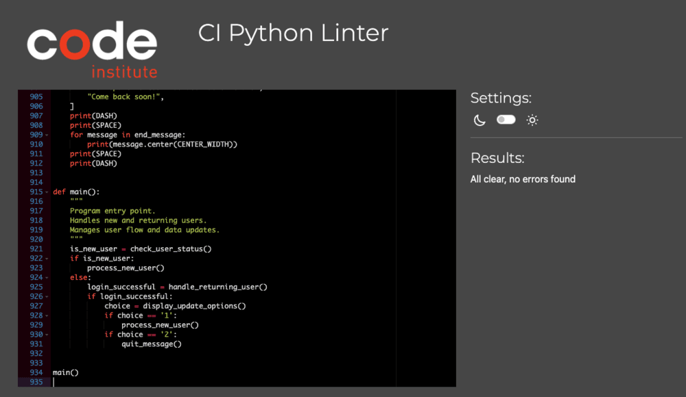

#### Validation Check for guide.py using CI Python Linter 

[Back to Contents](#contents)

## Deployment
This project was deployed using the Code Institute’s mock terminal for Heroku.

Steps for deployment:
1. Add the list of requirements by writing in the terminal "pip3 freeze > requirements.txt".
2. Log into Heroku.
4. Click "NEW" in the top right-hand corner and choos the option Create new app.
5. Input a unique app name.
6. Choose Region - Europe.
7. Choose "Settings" from the menu.
8. Go to section "Config Vars" and click button "Reveal Config Vars”.
9. Add key and value. For this project I added creds.json as the key and copied the contents of this into the value.
10. Go to section "Build packs" and click "Add build pack”.
11. Go to "Deploy" in the menu bar.
12. Go to section "deployment method", choose "GitHub".
13. New section will appear "Connect to GitHub".
14. Type the name of your repository and click "search".
15. Once Heroku finds your repository - click "connect".
16. Click "Enable automatic deploys" or manually deploy by choosing "Deploy branch".
17. Click "Deploy branch".

[Heroku Rehab-Metric Link](https://rehab-metrics-5347677ed9d1.herokuapp.com/)

[Back to Contents](#contents)

## Forking and Cloning
To fork this repository:

1. Log in to your Github account.
2. Navigate to the repository page.
3. Click the "Fork" button in the top-right corner.

To Clone:

1. Go to the forked repository on Github.
2. Click the green "Code" button.
3. Copy the HTTPS link: https://github.com/DavidRC-Projects/Rehab_Metrics.git.
4. Open your terminal and type: git clone https://github.com/DavidRC-Projects/Rehab_Metrics.git.

[Back to Contents](#contents)

## Credits

[Canva Dream Lab](https://www.canva.com/dream-lab) - Used to create the rehab metrics image featured in the introduction.

[Geeksfor Geeks](https://www.geeksforgeeks.org/hiding-and-encrypting-passwords-in-python/) - This article introduced me to the idea of using the maskpass module to securely hide passwords in my project.

[Reddit: LearnPython Cheat Sheets](https://www.reddit.com/r/learnpython/comments/11eg5af/beginners_python_cheat_sheets_updated/) - I used this helpful cheat sheet to better understand Python syntax and functionality during development.

The Love Sandwiches project (Code Institute) - This project inspired me to use Google Sheets as a data storage solution and provided a foundation for connecting a Python app with a Google Worksheet.

[Gspread Github Repository](https://github.com/burnash/gspread) - Offered clear documentation and code examples for working with Google Sheets using Python.

[YouTube Tutorial by Tech With Tim](https://www.youtube.com/watch?v=cnPlKLEGR7E) and [Google Sheets Playlist](https://www.youtube.com/playlist?list=PL3JVwFmb_BnSee8RFaRPZ3nykuMRlaQp1-) - These videos helped me understand how to read from and write to specific rows, columns, and cells in Google Sheets using Python.

[Nice Guidelines](https://www.nice.org.uk/guidance/ng157) - Informed the clinical advice provided within the application, supplemented by my own physiotherapy background.

[Back to Contents](#contents)

## Acknowledgements

* I would like thank my mentor Jubril Akolade for his advice, expert guidance and support.
* I would like to thank my partner and family for their unwavering support during this project.

[Back to Contents](#contents)
